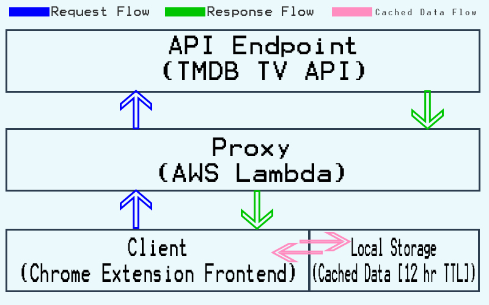
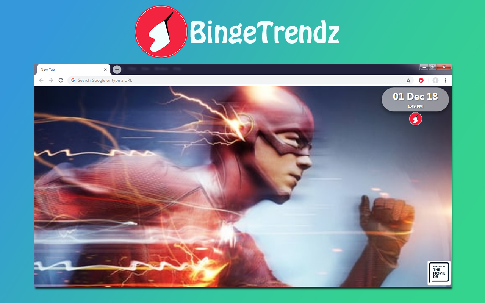
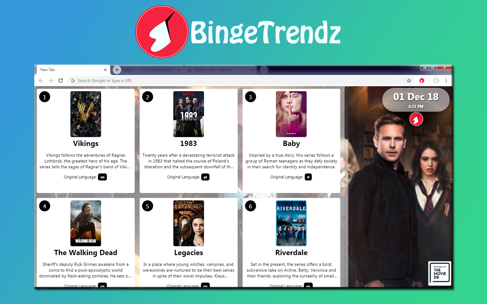

<h1 align="center">
   BingeTrendz
   
  
</h1>
 A chrome extension that lists the top 20 trending series of the day on the new tab of the browser.

# Description

This is a chrome extension that alters the default tab into a trending leaderboard for TV series; listing the top 20 trending series of that particular day.

# Architecture

<h1 align="center">
  
</h1>

- The proxy is used here to prevent the API key from being exposed on the client side.

# Screenshots

<h1 align="center">
  
  
</h1>

# Stack

- Javascript (ES5)
- HTML / CSS
- Node.js
- Axios
- AWS Lambda
- Serverless

# Data API
The data is provided by the TMDB TV API.

# Build

To build the project from source

- `npm run build`
